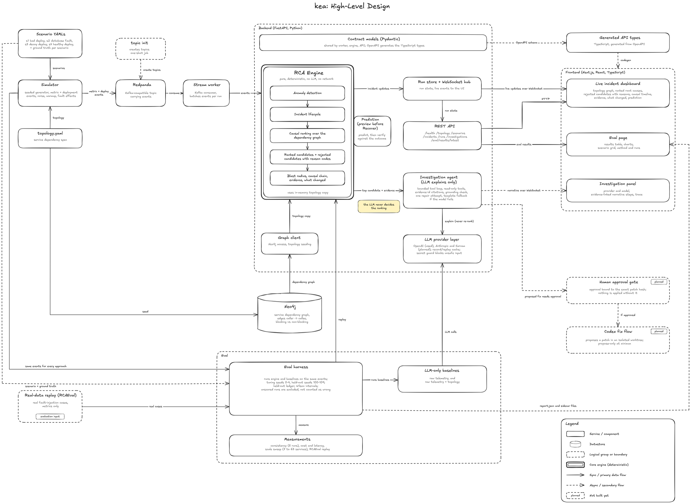
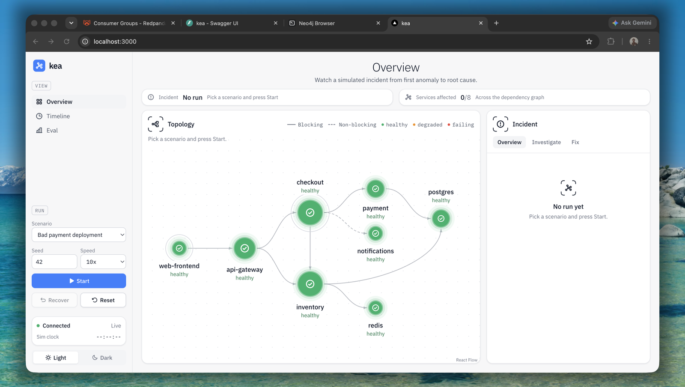
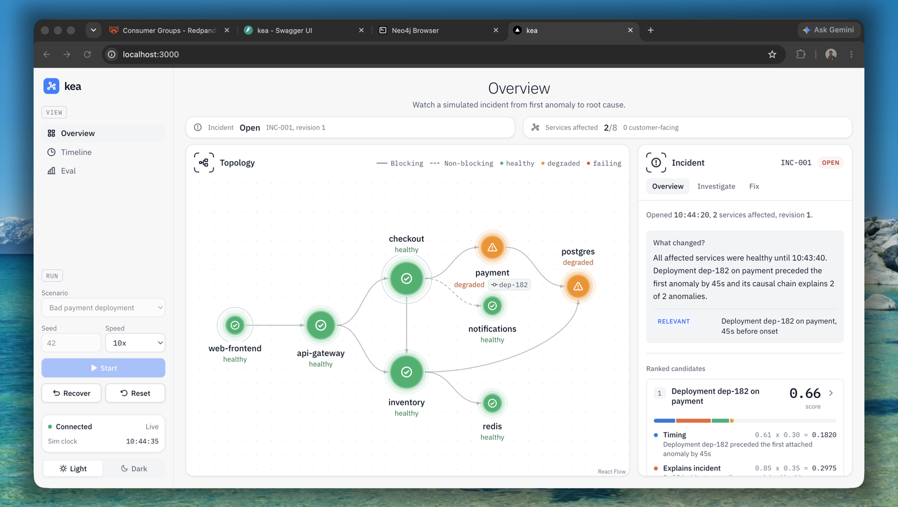
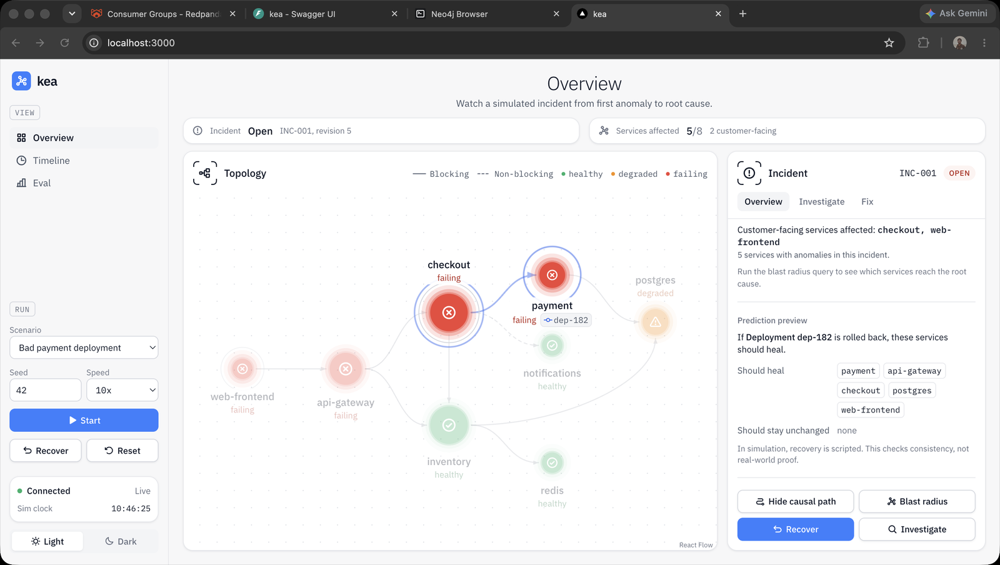
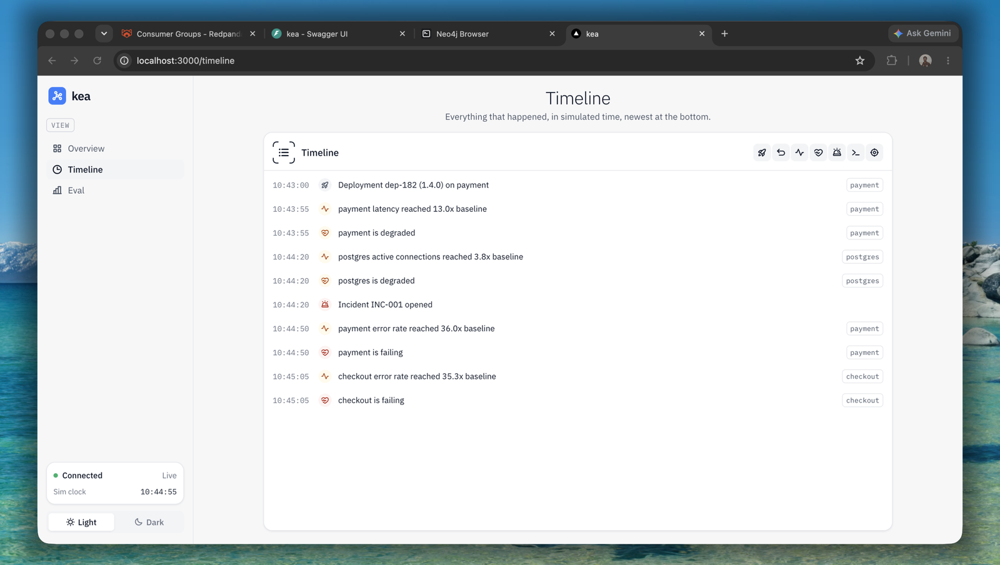
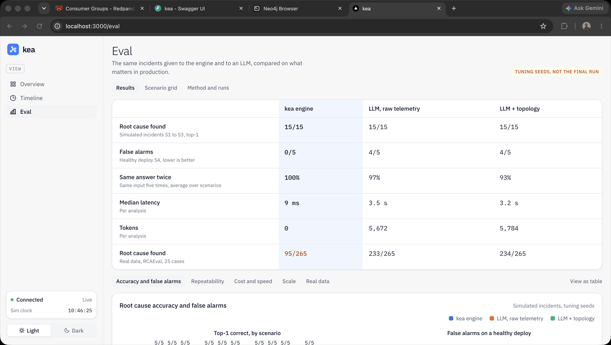
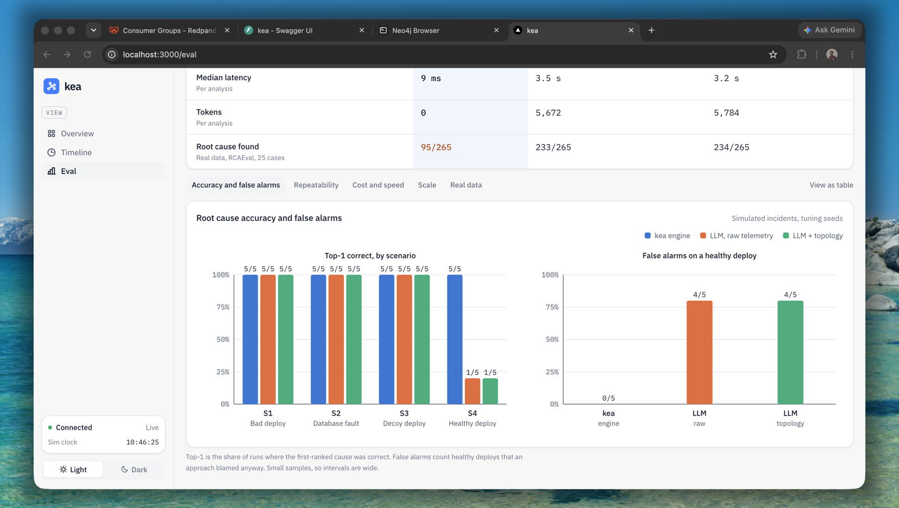
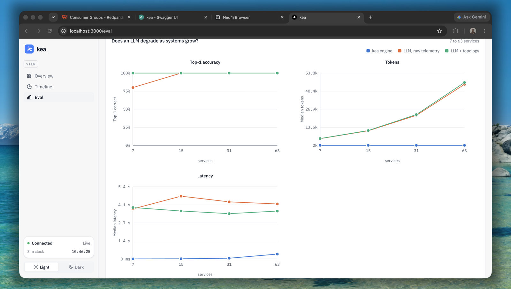

<div align="center">

# kea

**A real-time incident causality engine.**
A deterministic engine finds the root cause. An LLM explains it. A benchmark checks both.


</div>

---

## Overview

When production breaks, dashboards show a dozen red services and the on-call engineer has to work out what changed, what failed first, and how the failure spread. **kea automates that first hour.**

It watches a stream of metric and deployment events, builds a live service dependency graph, and ranks root-cause candidates. Every candidate carries a per-factor score, and every candidate it rejected carries a reason code, for example: *"deployment on `notifications` rejected: no dependency path to the affected services"*.

The ranking comes from a **deterministic engine** (pure Python, no LLM, no network). An **investigation agent** then explains what the engine found, citing evidence ids, and never re-ranks. A **human-gated fix flow** lets a coding agent *propose* a code fix that a person approves by exact patch hash.

## Problem Statement

Incident response is slow because the evidence is scattered and the causal story has to be rebuilt by hand under pressure. Two things make it worse:

- **Red herrings.** A harmless deployment lands just before an unrelated failure, and the team rolls back the wrong thing.
- **Untrustworthy AI.** Tools that ask an LLM to guess the root cause from raw telemetry are hard to audit, give different answers on different runs, and raise false alarms on healthy changes.

## Solution

kea splits the job so that each part does what it is good at.



| Stage | What happens |
|---|---|
| **Ingest** | A seeded simulator publishes metric and deployment events to **Redpanda** (Kafka API). A stream worker consumes and deduplicates them. |
| **Decide** | The **RCA engine** detects anomalies, opens an incident, and ranks candidates over the dependency graph. It is pure and deterministic: the same events always give the same ranking. |
| **Explain** | The **investigation agent** reads the engine's output through read-only tools and writes a narrative. Every claim cites an evidence id that must exist, or the output falls back to a labelled template. |
| **Measure** | The **eval harness** runs the engine and LLM-only baselines on identical events, plus repeatability, cost, scale and real-data (RCAEval) checks. |
| **Fix** | The **fix flow** proposes a patch in a sandbox and waits for a human to approve it by diff hash. |

### Inspiration

The backend architecture is inspired by Netflix's real-time distributed graph system: events stream in continuously, and a graph of how things relate is kept up to date so questions about relationships can be answered as things happen. **kea tries to replicate a much smaller version of that idea** for incident analysis: a Kafka-compatible stream (Redpanda) feeds a worker, and a live service dependency graph (Neo4j plus an in-memory copy) is what the engine reasons over. It is a single-node hackathon-scale take on the pattern, not a reimplementation of Netflix's system, and it has no affiliation with Netflix.

### Why not just ask an LLM?

Measured on simulated incidents (tuning seeds 0-4, baseline model `gpt-5.6-terra`, small samples, wide intervals):

| Question | kea engine | LLM only |
|---|---|---|
| Finds the root cause (S1 to S3) | 5/5 per scenario | 5/5 per scenario (a tie) |
| False alarms on a healthy deploy (S4) | 0 of 5 | 4 of 5 |
| Gives the same answer when run again | 100% | 87% on S4 and on S2 with topology |
| Median time and tokens per analysis | about 9 ms, 0 tokens | about 3.5 s, about 5.7k tokens |

The engine does **not** beat an LLM on root-cause accuracy here, and on real telemetry it is clearly worse (see [Limitations](#limitations)). Its measured edge is false alarms on healthy deploys, repeatability, cost, speed, and evidence you can audit.

## Features

- **Deterministic root-cause ranking** with per-factor scores, rejected candidates and reason codes.
- **Live topology graph** with service health, blast radius and a causal timeline.
- **Predict, then verify.** Before Recover the engine predicts which services will heal; afterwards it checks the prediction against the outcome.
- **Grounded investigation agent** with a bounded tool loop, evidence-cited steps, a grounding check, one repair attempt and a template fallback. Badges show `LIVE`, `REPLAYED` or `TEMPLATE`.
- **Human-gated fix flow.** A coding agent proposes a fix in a throwaway sandbox. The reviewer sees the diff, an explanation, and tests going from red to green, then approves by exact diff hash.
- **Benchmark page** (`/eval`) comparing the engine with LLM-only baselines, with confidence intervals, repeatability, cost, a scale sweep, and a replay of real fault injections.
- **Safety by construction.** A secret guard blocks unsafe outbound LLM requests, a held-out ledger records every held-out evaluation, and LLM runs can be recorded and replayed offline.

## Tech Stack

- **Frontend:** Next.js 16 (App Router), React 19, TypeScript, Tailwind CSS v4, zustand, `@xyflow/react`; API types generated from OpenAPI.
- **Backend:** Python 3.13, FastAPI, Pydantic v2, aiokafka, managed with uv.
- **Database:** Neo4j 5.26 Community (service dependency graph). Run state is held in memory.
- **APIs / Services:** Redpanda (Kafka API), OpenAI Responses API, Codex CLI (fix backend).
- **Hosting / Deployment:** Docker Compose on a local machine. No hosted deployment.
- **Other Tools:** pytest, ruff, strict mypy, Playwright (browser checks), RCAEval (real fault-injection data).

## Codex / OpenAI Usage

**In the product**

- **OpenAI API.** The investigation agent and the LLM-only baselines call the OpenAI Responses API (`gpt-5.6-terra`). The LLM only explains; the engine decides.
- **Codex CLI as the fix backend.** The fix flow runs `codex exec` non-interactively inside the sandbox, with a cleaned environment and a workspace-write sandbox. If the CLI is unavailable it falls back to an OpenAI tool loop. On the seeded bug, both the Codex CLI and the OpenAI tool loop produced a fix that turned the failing test green. In the default Docker setup the Codex CLI is not installed in the container, so the tool loop is what runs.

**During the build**

- **Codex** implemented the engine milestones, the streaming pipeline, the investigation agent, the eval harness, and the real-data experiments, working from written specs with tests as the acceptance criteria.
- **Claude Code** was used for planning and specs, reviewing and verifying each milestone, the dashboard and eval UI, the fix flow, and this README.
- A human directed the work and checked each milestone against its tests and a live run before it was merged. The backend has 87 passing tests, plus strict type checking and lint.

## Demo

### Live Demo

Not hosted. kea runs locally with Docker Compose (see [How to Run Locally](#how-to-run-locally)).

### Demo / Pitch Video

[Watch the demo video](https://drive.google.com/file/d/1OeVkG5aGKaDr3Y5QfOYFHiVtRHdWgNr2/view?usp=sharing)

## Screenshots

**Live dashboard.** The service topology with live health, and the incident panel with Overview, Investigate and Fix tabs.



**Incident opened.** The engine has ranked the deployment as the root cause and says what changed: the payment deployment came 45 seconds before the first anomaly, with a per-factor score breakdown.



**Causal path and prediction.** As the failure spreads, the causal path is highlighted and the engine previews which services should heal if the deployment is rolled back.



**Timeline.** Every deployment, anomaly and health change of one run, in simulated time.



**Benchmark.** kea against LLM-only baselines on the same incidents, in one table and then in charts.







## How to Run Locally

**Prerequisites:** Docker with about 8 GB of memory, Python 3.13, [uv](https://docs.astral.sh/uv/), Node.js and pnpm.

```bash
git clone https://github.com/mohi-devhub/kea.git
cd kea
cp .env.example .env      # set NEO4J_PASSWORD to any local password
make up                   # Redpanda, Neo4j, API, worker, frontend
```

| Service | URL |
|---|---|
| Dashboard | http://localhost:3000 |
| API docs | http://localhost:8000/docs |
| Neo4j browser | http://localhost:7474 |
| Redpanda console (optional) | `docker compose --profile tools up -d redpanda-console`, then http://localhost:8080 |

Open the dashboard, choose a scenario, press **Start**, and press **Recover** once the incident opens. In the incident panel, open the **Fix** tab and press **Propose a fix**.

**LLM providers.** `.env.example` holds placeholders only. The default `LLM_PROVIDER=template` needs no key and shows template explanations. To use OpenAI, set `LLM_PROVIDER=openai`, `LLM_MODEL` and `OPENAI_API_KEY` in your local, git-ignored `.env`. The fix flow needs a provider (or the Codex CLI on your `PATH`, when the API runs on the host).

| Command | What it does |
|---|---|
| `make test` | Fast unit tests, no infrastructure needed |
| `make test-int` | Integration tests (needs Redpanda and Neo4j) |
| `make scenarios` | Batch S1-S4 acceptance matrix on tuning seeds |
| `make demo-check` | End-to-end smoke test of S1-S4 through the running stack |
| `make eval` | Benchmark report (falls back to templates without a key) |
| `make types` | Export OpenAPI and regenerate the frontend types |
| `make lint` | ruff, mypy, eslint, typecheck |
| `make down` / `make reset` | Stop the stack / wipe volumes and reseed |

### Scenarios

| ID | What happens | Correct answer |
|---|---|---|
| S1 `s1_bad_deploy_payment` | A payment deployment causes a cascading checkout outage | Deployment `dep-182` on `payment` |
| S2 `s2_postgres_degradation` | A database fault, hidden behind an earlier payment deployment | Fault on `postgres`; the deployment is a decoy |
| S3 `s3_red_herring_deploy` | An unrelated `notifications` deployment precedes a cache failure | Fault on `redis`; the deployment must be rejected |
| S4 `s4_benign_deploy` | A harmless change and one metric spike | No incident should open |

### Repo layout

```
backend/app/engine/      deterministic causality engine (no LLM)
backend/app/simulator/   seeded scenario events and publisher
backend/app/stream/      Kafka consumer and worker
backend/app/graph/       Neo4j client and topology seeding
backend/app/agent/       investigation agent, tools, grounding, templates
backend/app/fix/         fix flow: sandbox, backends, approval gate
backend/app/llm/         provider layer, cache, secret guard, OpenAI adapter
backend/app/eval/        harness, baselines, grading, metrics
frontend/                Next.js dashboard, /eval and /timeline pages
scenarios/               S1-S4 YAMLs and topology.yaml
assets/                  architecture diagram and screenshots
```

## Additional Notes

### The fix flow: propose only, and where it goes next

**What is enabled now.** For an incident whose root cause is a deployment, kea:

1. clones a demo repo into a throwaway sandbox (nothing outside the sandbox is written);
2. runs the tests, which fail on the bad commit;
3. lets a coding agent edit source files in the sandbox only (existing tests may not be touched);
4. hashes the exact diff (SHA-256), reruns the tests, and writes a short explanation that cites incident evidence;
5. shows the diff, explanation and before/after test results, and waits for a human.

The human approves by sending the exact diff hash. A wrong hash is refused, a red or test-weakening proposal cannot be approved, and approving twice does nothing new.

**Approval records; it does not apply.** In this build, approving stores who approved which hash, and stops. No branch, commit or pull request is created, and the UI says so. The code path that would do it is reserved in `backend/app/fix/apply.py`, which currently only raises "not enabled".

**Future expansion**

- Apply the approved diff to a new branch after re-checking its hash, and commit it with `Approved-by` and `Proposed-by` trailers.
- Draft a pull request: a local markdown draft first, then a GitHub draft PR with the token read from the environment only.
- Re-verify automatically after applying, and roll the branch back if verification fails.
- Support incident types beyond code-change root causes (configuration, scaling, dependency faults).
- Make Codex CLI the default backend inside the container, and add Anthropic and Sarvam provider adapters.
- Use approved and rejected proposals as feedback for the engine's ranking, behind the same approval and overfitting safeguards.

### How results are measured

- Engine settings are tuned only on tuning seeds 0-4. Final numbers use held-out seeds 100-109, and every held-out evaluation is logged in `eval_results/.heldout_log`.
- Baselines receive the same events and none of the engine's output. Their prompts are written as a competent engineer would write them and are not tuned to make them fail.
- Intervals are 95% Wilson intervals. Runs that produced no answer are excluded and shown as not run; malformed answers count as wrong.

### Limitations

- **kea loses on real data.** The engine was built on clean simulated telemetry, and on real fault injections (RCAEval) the LLM baselines find the root cause far more often. On the first 25 Online Boutique cases the engine found 4 and the LLMs 14. On a later frozen split of 265 unseen cases (never used for tuning), the engine found 95 (36%), and the two LLM baselines 233 and 234 (88%). Adding CPU and network metrics, noise-robust thresholds and a small learned reranker raised the best kea variant to 130 of 265 (49%), which is still well below the LLM. The replay covers the service-fault path only. That work lives on a separate branch (`m5-realdata`) and is not part of this build.
- **Simulated results are small-sample.** They use 5 tuning seeds and one LLM. The final held-out run has not been done yet.
- An LLM does not degrade with topology size in our sweep (7 to 63 services); its cost grows instead, from about 5k to about 46k tokens per analysis.
- Only the OpenAI adapter exists. Neo4j is a single node and one incident is handled per run.
- The fix flow works on a small generated demo repo, not on arbitrary repositories.
- Run state, incidents and fix proposals are kept in memory and are lost when the API restarts. There is no authentication; kea is built to run on a local machine.

## Future Scope

**Accuracy on real telemetry (the biggest gap)**
- Review and merge the real-data work on `m5-realdata`, then keep going: use logs and traces (RCAEval RE2 and RE3 include them), not only metrics, and fit the engine's metric mapping to more real systems.
- Use the LLM where it is strong, as a reranker over the engine's top candidates, while the engine keeps the evidence trail and the no-false-alarm behaviour. Measure it against the plain LLM on the frozen test split.
- Run the final held-out evaluation (seeds 100-109) once, and publish it.

**Real ingestion**
- Adapters for OpenTelemetry and Prometheus so a real service fleet can feed `POST /events`, instead of the simulator.
- Deployment events straight from CI/CD systems, and topology discovered from traces instead of a hand-written `topology.yaml`.

**Product**
- Persist runs, incidents and proposals in a database, and support many concurrent incidents.
- Authentication, roles, and an audit log of every approval.
- Notifications and hand-offs to Slack and PagerDuty.
- More scenarios: concurrent deployments, config changes, regional failures, slow-burn degradation.
- Anthropic and Sarvam provider adapters, so the explanation and fix backends are not tied to one vendor.
- Learning from outcomes: use approved and rejected proposals and confirmed root causes to adjust the engine's priors, behind the same human-approval and overfitting safeguards.

**Fix flow** (see the expansion list above): apply after approval, draft pull requests, re-verify, and cover non-code root causes.

**Scale and deployment**
- Neo4j clustering and stream partitioning for larger topologies (the scale sweep shows engine latency growing from 8 ms to 367 ms at 63 services), and a hosted deployment.

